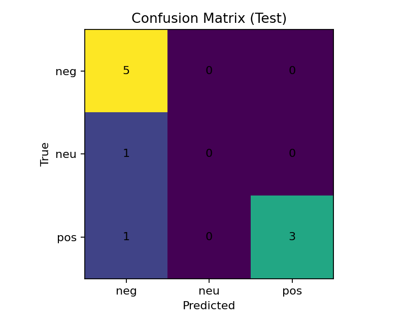

# 🛒 Amazon Review Sentiment Analyzer

Baseline sentiment analysis on Amazon product reviews using **TF-IDF + Logistic Regression**.  
The goal is to build a clear, modular, and reproducible NLP pipeline for text classification (negative, neutral, positive).

---

## 📌 Context

The project was originally designed to run on the **Amazon Reviews** dataset (`amazon_reviews_us_Beauty_v1_00.tsv.gz`).  
However, public Amazon datasets were removed from Hugging Face in 2024.  

➡️ **To avoid blocking development**, this M1 uses the **Yelp Review Full** dataset (1–5 star ratings) as a *fallback*.  
The pipeline remains fully **compatible with Amazon TSV/TSV.GZ dumps**: just set `DATA_SRC` to your local Amazon file and rerun `src/data.py`.

---

## 📂 Project Structure

```

amazon-review-sentiment-analyzer/
├── data/                  # train/val/test.parquet
├── metrics/               # evaluation reports
│   ├── baseline\_val.json
│   └── baseline\_test.json
├── models/
│   └── baseline/tfidf\_lr.joblib
├── reports/               # visuals and reports
│   ├── confusion\_matrix\_test.png
│   ├── classification\_report\_test.json
│   ├── classification\_report\_test.csv
│   └── misclassified\_test.csv
├── src/
│   ├── data.py            # data preparation
│   ├── train\_sklearn.py   # TF-IDF + Logistic Regression baseline
│   ├── train\_hf.py        # (M2) Hugging Face Transformers baseline
│   └── eval\_hf.py
├── README.md
└── requirements.txt

````

---

## ⚙️ Usage

### 1. Prepare data
With Yelp fallback (default 100k rows):
```bash
export YELP_ROWS=100000
python src/data.py
````

With Amazon TSV/GZ (if you have the local dump):

```bash
export DATA_SRC=data/raw/amazon_reviews_us_Beauty_v1_00.tsv.gz
python src/data.py
```

This generates:

```
data/train.parquet
data/val.parquet
data/test.parquet
```

---

### 2. Train baseline

```bash
python src/train_sklearn.py
```

This saves:

```
models/baseline/tfidf_lr.joblib
metrics/baseline_val.json
metrics/baseline_test.json
```

---

### 3. Generate visuals

```bash
python src/report_baseline.py
```

This saves:

```
reports/confusion_matrix_test.png
reports/classification_report_test.json
reports/classification_report_test.csv
reports/misclassified_test.csv
```

---

## 📊 Baseline Results (M1)

Example run with a small Yelp subset:

**Validation**

```
accuracy: 0.70
neg:  precision=0.75  recall=1.00  f1=0.83
neu:  no examples in this sample
pos:  precision=0.67  recall=0.80  f1=0.73
```

**Test**

```
accuracy: 0.80
neg:  precision=0.71  recall=1.00  f1=0.83
neu:  no examples in this sample
pos:  precision=1.00  recall=0.75  f1=0.86
```

📌 Note: results are unstable with very small samples. With larger datasets (50k–100k+ reviews), metrics stabilize.

---

## 🔍 Baseline Visuals

Example confusion matrix on the test set:



Additional reports:

* [Classification Report (CSV)](reports/classification_report_test.csv)
* [Misclassified Examples (CSV)](reports/misclassified_test.csv)

---

## 🚀 Roadmap

* **M2:** Train a baseline Transformer model (e.g. `distilbert-base-uncased`) with Hugging Face (`src/train_hf.py`).
* **M3:** Compare baseline TF-IDF+LR vs Transformers.
* **M4:** Serve the model via API (FastAPI/Flask).
* **M5:** Build a dashboard for metrics and visualizations.

---

## 📖 Notes

* Compatible with **Amazon Reviews TSV/GZ dumps** (if available).
* Yelp is used **only as a temporary fallback** to validate the pipeline.
* The modular design ensures data sources can be swapped without changing the training/evaluation code.

---

## 👩‍💻 Author

Developed by **Gabrielle Rodrigues**  
[LinkedIn](https://www.linkedin.com/in/grdrgs/) | [GitHub](https://github.com/Gabxrielle)

```