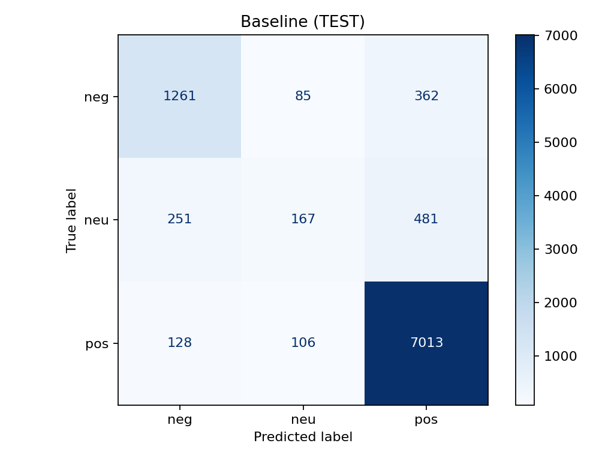
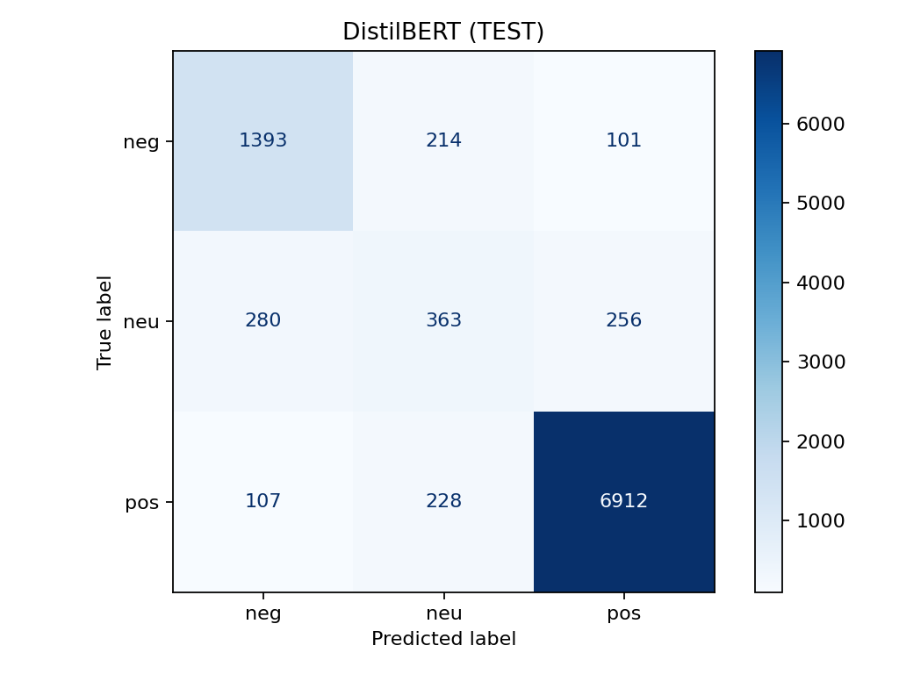

````markdown
# Amazon Product Reviews — Sentiment Analysis (neg / neu / pos)

This repository implements an end-to-end text classification pipeline that assigns **negative**, **neutral**, or **positive** sentiment to Amazon product reviews. It includes streaming data ingestion from Hugging Face, labeling, stratified splitting, a **TF-IDF + Logistic Regression** baseline, a **DistilBERT** fine-tuned model, and evaluation artifacts (metrics JSON + confusion matrices).

---

## Contents

- [Overview](#overview)  
- [Repository Layout](#repository-layout)  
- [Environment & Requirements](#environment--requirements)  
- [Data Pipeline](#data-pipeline)  
- [Models](#models)  
- [Reproducible Run](#reproducible-run)  
- [Results](#results)  
- [Confusion Matrices (TEST)](#confusion-matrices-test)  
- [Configuration](#configuration)  
- [Notes on Data Usage](#notes-on-data-usage)  
- [Roadmap](#roadmap)  
- [License](#license)  
- [Acknowledgments](#acknowledgments)

---

## Overview

- **Task:** 3-class sentiment classification (neg / neu / pos) from review text.  
- **Dataset:** `McAuley-Lab/Amazon-Reviews-2023` (Hugging Face).  
- **Labeling:** star ratings → sentiment  
  - `1–2 → neg`, `3 → neu`, `4–5 → pos`.  
- **Splits:** stratified **train/val/test** persisted as **Parquet**.  
- **Models:**  
  - Baseline **TF-IDF + Logistic Regression** (fast and strong).  
  - **DistilBERT** (Transformers) with fine-tuning.  
- **Metrics:** Accuracy, macro-averaged F1, confusion matrix.

---

## Repository Layout

```text
amazon-review-sentiment-analyzer/
├─ data/                          # train/val/test .parquet
├─ metrics/                       # JSON metrics (baseline & bert)
├─ models/
│  ├─ baseline/                   # TF-IDF + LR (joblib)
│  └─ distilbert/                 # HF checkpoint after fine-tuning
├─ reports/
│  └─ figures/                    # confusion matrices (.png)
├─ notebooks/
│  └─ 01_eda.ipynb                # optional exploration
├─ src/
│  ├─ data.py                     # ingestion + labeling + splits + parquet
│  ├─ train_sklearn.py            # baseline (train & eval)
│  ├─ train_hf.py                 # DistilBERT fine-tuning (val metrics)
│  └─ eval_hf.py                  # DistilBERT evaluation on TEST
└─ requirements.txt
````

---

## Environment & Requirements

Tested with **Python 3.12** on macOS (Apple Silicon). **CPU** is the default device; **MPS** can be used if desired.

```text
datasets==4.40.0
transformers==4.44.2
accelerate==0.33.0
evaluate==0.4.2
torch>=2.2
protobuf>=4,<5
scikit-learn>=1.3
pandas>=2.0
pyarrow>=15
joblib>=1.3
matplotlib>=3.7
huggingface_hub>=0.23
# (optional) seaborn>=0.12 for alternative plotting styles
```

Create/activate venv and install:

```bash
python -m venv .venv
source .venv/bin/activate
pip install -U pip
pip install -r requirements.txt
```

Login to Hugging Face (required to access the dataset):

```bash
huggingface-cli login
```

---

## Data Pipeline

**Source:** `McAuley-Lab/Amazon-Reviews-2023` on the Hugging Face Hub (`raw/review_categories/*.jsonl`).

**Steps (`src/data.py`):**

1. **Streaming ingestion:** read JSONL in streaming mode (does not load the entire dataset into RAM).
2. **Label mapping:** convert star ratings to `neg/neu/pos`.
3. **(Optional) Sampling / filters:** limit records or categories (edit constants near the top of the file).
4. **Stratified split:** **train / val / test** (ratios defined in code).
5. **Persistence:** `data/train.parquet`, `data/val.parquet`, `data/test.parquet`.

---

## Models

### 1) Baseline — TF-IDF + Logistic Regression

* **Vectorizer:** word-level TF-IDF.
* **Classifier:** `sklearn.linear_model.LogisticRegression`.
* **Artifacts:**

  * `models/baseline/tfidf_lr.joblib`
  * `metrics/baseline_val.json`, `metrics/baseline_test.json`

**Run:**

```bash
python src/train_sklearn.py
```

### 2) DistilBERT — Fine-tuning

* **Backbone:** `distilbert-base-uncased`.
* **Tokenization:** truncation with `max_length=128`.
* **Training:** see `src/train_hf.py` (defaults \~3 epochs).
* **Device:** CPU by default; MPS optional on Apple Silicon.

**Train & validate:**

```bash
python src/train_hf.py
# saves to models/distilbert/ and prints VAL metrics
```

**Evaluate on TEST:**

```bash
python src/eval_hf.py
# writes metrics/bert_test.json
```

---

## Reproducible Run

```bash
# 1) prepare data
python src/data.py

# 2) train baseline
python src/train_sklearn.py

# 3) train DistilBERT (VAL metrics printed)
python src/train_hf.py

# 4) evaluate DistilBERT on TEST
python src/eval_hf.py
```

**Generate confusion matrices (no seaborn required):**

```bash
python - << 'PY'
import os, json, numpy as np, matplotlib.pyplot as plt
from sklearn.metrics import ConfusionMatrixDisplay

os.makedirs("reports/figures", exist_ok=True)
labels = ["neg","neu","pos"]

def plot_cm(path, out, title):
    m = json.load(open(path))
    cm = np.array(m["confusion_matrix"], dtype=int)
    fig, ax = plt.subplots(figsize=(4.8,4.8))
    ConfusionMatrixDisplay(confusion_matrix=cm, display_labels=labels)\
        .plot(ax=ax, cmap="Blues", values_format="d", colorbar=False)
    ax.set_title(title)
    plt.tight_layout()
    plt.savefig(out, dpi=160)
    plt.close(fig)

plot_cm("metrics/baseline_test.json", "reports/figures/baseline_cm.png", "Baseline (TEST)")
plot_cm("metrics/bert_test.json",      "reports/figures/bert_cm.png",     "DistilBERT (TEST)")
print("Figures saved to reports/figures/")
PY
```

> **Tip (MPS on macOS):** you can use `device_str="mps"` in `src/eval_hf.py` (and optionally in `train_hf.py`). If you run out of memory, switch back to CPU or reduce `batch_size` / `max_length`.

---

## Results

**Validation (from `train_hf.py` logs):** accuracy ≈ **0.885**; macro F1 ≈ **0.740** (DistilBERT).

**Test (from metrics JSONs):**

| Model             | Val ACC | Val F1-macro | Test ACC | Test F1-macro |
| ----------------- | :-----: | :----------: | :------: | :-----------: |
| TF-IDF + Logistic |  0.8575 |   \~0.6428   |  0.8566  |     0.6492    |
| DistilBERT        |  0.8854 |   \~0.7397   |  0.8770  |     0.7229    |

---

## Confusion Matrices (TEST)

Visual comparison of the models on the test set. Rows = true labels; columns = predicted labels.
Order of labels: **neg**, **neu**, **pos**.

| Baseline (TF-IDF + Logistic Regression)                                                          | DistilBERT                                                                                     |
| ------------------------------------------------------------------------------------------------ | ---------------------------------------------------------------------------------------------- |
|  |  |

<sub>Figures generated from `metrics/baseline_test.json` and `metrics/bert_test.json`.</sub>

---

## Configuration

Most parameters can be adjusted directly in the scripts:

* **`src/data.py`**

  * category filters / sampling
  * split ratios and seed
* **`src/train_sklearn.py`**

  * TF-IDF n-gram range, `min_df`/`max_df`, LogisticRegression C/penalty
* **`src/train_hf.py`**

  * `max_length`, epochs, micro-batch size, eval every N steps, learning rate, weight decay
* **`src/eval_hf.py`**

  * device (`cpu` or `mps`), batch size, `max_length`

**Determinism tips (optional):**
set a global seed (numpy/torch) and disable non-deterministic kernels if using CUDA (not applicable to CPU/MPS).

---

## Notes on Data Usage

* The dataset is hosted on the Hugging Face Hub and may require accepting terms.
* Respect the dataset’s license/terms and any platform policies.
* This repository **does not** redistribute raw datasets; it streams and derives labeled subsets locally.

---

## Roadmap

* **Error analysis:** where baseline and DistilBERT disagree; focus on neutral confusions.
* **Light tuning:** class weights for neutral, LR/batch/length adjustments.
* **Demo:** small Streamlit/Gradio app comparing baseline × BERT and a short model card.

---

## License

This project is licensed under the **MIT License**. See `LICENSE` for details.
© 2025 **Gabrielle Rodrigues**

> (Optional) SPDX header for new source files: `# SPDX-License-Identifier: MIT`

---

## Acknowledgments

* McAuley Lab — **Amazon-Reviews-2023** (Hugging Face)
* Hugging Face (`datasets`, `transformers`) and scikit-learn communities

```
```